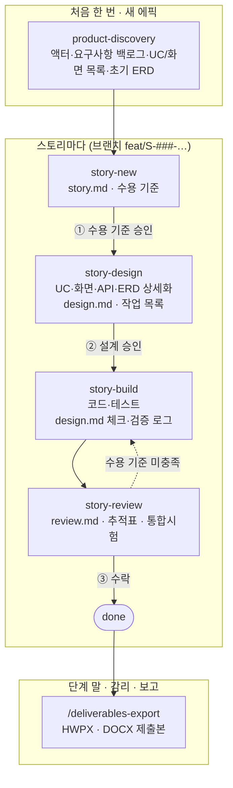

# 개발 프로세스 가이드 — 애자일 + 산출물

이 저장소에서 기능을 만드는 방법을 설명한다. 대상은 개발자와 PM이다.
Claude Code를 쓰면 흐름의 대부분을 스킬이 이끌지만, **승인은 사람이 한다.** 무엇을 언제 승인하는지 알아야 한다.

- 프로세스 규칙의 원본: [docs/stories/README.md](../stories/README.md) (스토리), [docs/product/README.md](../product/README.md) (제품 문서)
- 제출 산출물 대응표: [docs/deliverables/README.md](../deliverables/README.md)

## 1. 왜 이 방식인가

공공 용역·R&D는 요구사항 정의서, 화면 설계서, ERD, 시험 결과서 같은 산출물을 요구한다.
산출물을 단계 말에 몰아서 쓰면 코드와 어긋나고, 감리에서 추적이 끊긴다.
반대로 산출물을 처음에 전부 쓰고 개발하면(폭포수) 바뀌는 요구를 따라가지 못한다.

그래서 이렇게 한다.

1. **처음에는 뼈대만 만든다** — 액터, 요구사항 목록, 유스케이스·화면 **목록**, 초기 ERD.
2. **스토리마다 필요한 만큼 상세화한다** — 이번 스토리가 건드리는 유스케이스·화면·API·ERD만.
3. **스토리를 끝낼 때 문서와 코드를 맞춘다** — 추적표와 시험 기록도 이때 갱신한다.
4. **단계 말에는 그 시점의 원본으로 제출본을 만든다** — 따로 쓰지 않는다.

결과적으로 산출물은 개발하는 동안 조금씩 쌓이고, 제출 시점에는 이미 코드와 맞아 있다.

## 2. 전체 흐름



### 역할

| 역할 | 하는 일 |
|---|---|
| **PM / 제품 책임자** | 요구사항 우선순위 결정, 수용 기준 승인①, 스토리 수락③, 제출본 확인 |
| **개발자** | 설계 승인②, 구현 감독, 커밋·PR |
| **Claude Code** | 스킬에 따라 문서 작성·갱신, 구현, 테스트 실행, 증거 수집. **승인 지점에서 멈춘다** |

한 사람이 PM과 개발자를 겸해도 된다. 중요한 것은 ①②③을 사람이 명시적으로 하는 것이다.

## 3. 단계별 안내

### 3.0 제품 분석 뼈대 — `product-discovery`

**언제**: 프로젝트 시작, 새 에픽, `docs/product/`가 견본 상태일 때 (훅이 알려 준다).

```text
> RFP 문서(docs/rfp.pdf)를 분석해서 요구사항 백로그랑 유스케이스 목록 만들어줘
```

| 생기는 것 | 확인할 것 |
|---|---|
| `actors.md`, `requirements.md`, `use-cases/README.md`, `screens/README.md`, `erd.md`, `architecture.md`, `traceability.md` | 요구사항마다 **출처**가 있는가, 비기능 요구에 **측정 기준**이 있는가, 우선순위가 맞는가 |

유스케이스 명세·화면 정의 파일은 아직 만들지 않는다. 정상이다.

### 3.1 스토리 시작 — `story-new` → 승인①

**언제**: 기능을 추가·변경하고 싶을 때. 백로그에서 REQ를 골라도 되고 말로 요청해도 된다.

```text
> REQ-F-001 장비 상태 목록 화면 만들자
> 장비 목록에서 고장 난 장비만 필터링되게 해줘
```

| 생기는 것 | 확인할 것 (승인①) |
|---|---|
| `docs/stories/S-###-slug/story.md` — 사용자 스토리, **수용 기준**(Given/When/Then), 범위 밖, 미해결 질문 | 수용 기준이 "완료"의 정의로 충분한가, 경계 조건(권한·빈 결과·오류)이 있는가, 범위가 며칠 안에 끝나는가 |

승인하면 브랜치를 만든다: `git switch -c feat/S-###-slug`. 이후 훅이 브랜치 이름으로 이 스토리를 따라간다.

### 3.2 설계 — `story-design` → 승인②

```text
> 설계해줘
```

| 생기는 것 | 확인할 것 (승인②) |
|---|---|
| 이 스토리에 해당하는 `UC-###.md`, `SCR-###.md`(와이어프레임 포함), `api.md`·`interfaces.md` 행, DDL과 `erd.md` 변경 | 유스케이스 흐름이 수용 기준과 맞는가, 화면 요소·메시지가 맞는가 |
| `design.md` — 접근, 영향 범위, 테스트 계획, **작업 목록** | 작업이 한 번에 검증 가능한 크기인가, 수용 기준마다 시험 방법이 있는가 |

**제품 문서를 코드보다 먼저 고친다.** 설계 승인 = 이 문서들의 승인이다.

### 3.3 구현 — `story-build`

```text
> 구현 시작해
> 이어서 해줘          (새 세션에서도 design.md를 읽고 이어간다)
```

작업마다 Claude가 테스트를 쓰고 → 구현하고 → 모듈 테스트를 돌리고 → `design.md`에 체크와 검증 로그를 남긴다.
**이 로그가 중간 산출물**이다 (R&D 연구노트의 기초 자료로도 쓴다).

개발자가 할 일:
- 작업 단위로 결과를 확인하고 커밋한다 (`/commit`, 본문에 `Story: S-###`)
- 설계와 다르게 가야 한다고 Claude가 멈추면, 변경안을 판단한다

### 3.4 리뷰 — `story-review` → 수락③

```text
> 리뷰해줘
```

| 생기는 것 | 확인할 것 (수락③) |
|---|---|
| `review.md` — 수용 기준별 **증거**, 문서-코드 일치 체크 | 모든 AC에 증거(테스트 이름·실행 결과)가 있는가 |
| `traceability.md` 행, `integration-tests.md`의 `IT-###-n` 행 | 추적표에 이 스토리의 REQ→UC→SCR→API→테이블→시험이 이어졌는가 |
| 재생성된 `generated/table-spec.md`, `generated/program-list.md` | 프로그램 목록에 "문서 등록 N" 엔드포인트가 없는가 |

수락하면 `done`이 되고 REQ 상태가 갱신된다. 이후 PR을 올리고 머지한다.

### 3.5 제출본 — `/deliverables-export`

```text
> /deliverables-export 설계 단계 hwpx
```

자동 생성 문서를 다시 만들고, `<...>` 자리표시·빈 칸·미등록 엔드포인트를 먼저 보고한다. 확인 후 HWPX·DOCX를 `docs/deliverables/out/<날짜>/`에 만든다 (커밋하지 않음).

## 4. 산출물이 채워지는 시점

| 산출물 (원본) | discovery | story-new | story-design | story-build | story-review | 단계 말 |
|---|:---:|:---:|:---:|:---:|:---:|:---:|
| 요구사항 정의서 `requirements.md` | ● 뼈대 | ○ 행 추가 | | | ○ 상태 | |
| 액터 `actors.md` | ● | | ○ | | | |
| 유스케이스 `use-cases/` | ● 목록 | ○ 목록 행 | ● 명세 | | ○ 일치 확인 | |
| 화면 설계서 `screens/` | ● 목록 | ○ 목록 행 | ● 정의 | | ○ 일치 확인 | |
| API·인터페이스 `api.md`, `interfaces.md` | | | ● | | ○ 일치 확인 | |
| ERD `erd.md` + DDL | ● 초안 | | ● | | | |
| 테이블 정의서·프로그램 목록 `generated/` | | | | | ● 재생성 | ● 재생성 |
| 아키텍처 `architecture.md` | ● | | ○ 구조 변경 시 | | | ● |
| 스토리 기록 `story/design/review.md` | | ● | ● | ● 로그 | ● | |
| 추적표 `traceability.md` | ● 뼈대 | | | | ● | |
| 통합 시험 `integration-tests.md` | | | | | ● | |
| 단위 시험 결과서 `generated/` | | | | | | ● |
| 성능·보안·접근성 `docs/quality/` | | | | | ○ 해당 시 | ● |
| 매뉴얼 `docs/manuals/` | | | | | ○ 화면 변경 시 | ● |

● 주로 작성 · ○ 갱신

## 5. 공공 용역의 단계·감리와 맞추기

용역 계약은 보통 **착수 → 분석 → 설계 → 구현 → 시험 → 이행** 단계와 단계별 산출물 제출·감리를 전제한다.
애자일 반복을 이 틀에 맞추는 방법:

| 계약 단계 | 이 저장소에서 하는 일 | 단계 말 제출 |
|---|---|---|
| 착수 | 방법론 테일러링: 이 문서와 `docs/deliverables/README.md`를 RFP 기준으로 조정 | 사업수행계획서(레포 밖), 방법론 테일러링 결과서 |
| 분석 | `product-discovery` + 우선순위 높은 스토리의 `story-new` (수용 기준까지) | 요구사항 정의서, 유스케이스 명세서, 요구사항 추적표 |
| 설계 | 분석 단계 스토리들의 `story-design` (필요하면 첫 스토리 몇 개는 구현까지 — 설계 검증용) | 아키텍처, 화면 설계서, 인터페이스 정의서, ERD, 테이블·코드 정의서 |
| 구현 | 스토리 반복 (`story-new → … → story-review`) | 프로그램 목록, 단위 시험 결과서 |
| 시험 | 남은 스토리 마무리 + 시스템 시험(성능·보안·접근성) | 통합·시스템 시험 결과서, 점검 결과 |
| 이행 | 매뉴얼 정리, 운영 이관 | 사용자·운영자 매뉴얼 |

- 단계 말 제출본은 **그 시점 원본의 스냅샷**이다. 이후 스토리에서 문서가 바뀌면 다음 제출 때 반영된다.
  제출 이력(`docs/deliverables/README.md`)에 원본 커밋 해시를 남겨 두면 "제출 당시 무엇이었나"를 언제든 재현할 수 있다.
- 감리는 산출물 간 **일관성**(요구사항 ↔ 설계 ↔ 구현 ↔ 시험)을 본다. `story-review`가 매 스토리마다 이것을 맞추므로 단계 말에 몰아서 맞출 일이 줄어든다.
- 발주기관이 단계 순서를 엄격히 요구하면(설계 승인 전 구현 금지 등) 설계 단계의 "첫 스토리 구현"은 빼고, 프로토타입으로 표시해 분리한다.

## 6. 정부 R&D 과제에서 추가로

| 항목 | 이 저장소에서 |
|---|---|
| 정량 성능지표 | `requirements.md`에 `REQ-N`으로, 측정은 `docs/quality/performance.md`. 공인 시험(TTA 등) 스크립트·절차도 여기서 관리 |
| 연구노트 | 스토리 `design.md` 검증 로그가 기초 자료. **기관 연구노트 규정(서명, 전자연구노트 시스템)을 git만으로 충족하는지는 과제 관리 기관에 확인한다** |
| 연차·최종 보고서 | 레포 밖. 산출물과 추적표를 인용해 작성 |
| 프로그램 저작권 등록 | 소스 + 프로그램 목록 + 매뉴얼에서 자료 준비 |
| 보안과제 | AI 도구·외부 서비스 사용 가능 여부를 **먼저** 확인한다 |

## 7. 예시 한 바퀴

> 요구사항 `REQ-F-001 운영자는 장비별 최신 상태를 목록으로 조회할 수 있어야 한다`

1. `> REQ-F-001 장비 상태 목록 화면 만들자` → `S-001-device-status-list/story.md`
   - AC-1 목록에 장비명·상태·최종 수신 시각이 보인다 / AC-2 상태 필터 / AC-3 결과 없음 메시지 / AC-4 운영자 권한 없으면 403
   - PM이 AC-2의 필터 조건을 정해 주고 승인① → `git switch -c feat/S-001-device-status-list`
2. `> 설계해줘` → `UC-001` 명세, `SCR-001` 와이어프레임, `API-001` 행, `device_status` DDL·ERD, `design.md` 작업 T1–T5
   - 개발자가 T3(DDL)과 T4(API) 순서를 바꾸자고 하고 승인②
3. `> 구현 시작해` → 작업마다 테스트·구현·`design.md` 로그. 세션이 끊겨도 `> 이어서 해줘`
4. `> 리뷰해줘` → AC별 증거, `program-list`에서 `/api/devices/{id}` "문서 등록 N" 발견 → `api.md`에 `API-002` 추가
   - 추적표 `REQ-F-001 | UC-001 | SCR-001 | API-001, API-002 | device_status | S-001 | DeviceServiceImplTest, IT-001-1~4`
   - PM 수락③ → PR
5. 설계 단계 말: `> /deliverables-export 설계 단계 hwpx` → 화면 설계서·테이블 정의서 등 제출본

## 8. 자주 묻는 질문

**버그 하나 고치는 데도 스토리를 만들어야 하나?**
아니다. 질문·조사, 문서·오타, 설정값, 긴급 장애 대응은 스토리 없이 한다. 동작이 바뀌는 수정이면 작은 스토리로 만드는 편이 추적표에 남아 감리 때 편하다.

**Claude가 스토리 없이 바로 코드를 고치려 하면?**
훅은 안내만 하고 막지 않는다. "스토리부터 만들어"라고 말하면 된다. 반복되면 강제 모드(스토리·설계 없이 코드 수정 차단 훅)를 검토한다.

**설계 도중 요구사항이 바뀌면?**
`story.md`의 수용 기준을 고치고 다시 승인①을 받는다. 범위가 커지면 스토리를 나눈다.

**여러 명이 동시에 스토리를 진행하면?**
각자 자기 브랜치에서 진행한다. 훅은 브랜치 이름으로 스토리를 찾으므로 서로 영향이 없다.
제품 문서(`requirements.md`, `traceability.md`)는 머지 충돌이 날 수 있다 — 행 단위라 해결은 쉽다.

**`generated/` 문서가 틀렸다.**
손으로 고치지 않는다. 원본(DDL `comment on`, 컨트롤러, 테스트)을 고치고 `tools/deliverables/*.py`로 다시 만든다.

**산출물 명칭이 우리 사업 RFP와 다르다.**
`docs/deliverables/README.md`의 산출물 이름만 RFP에 맞게 바꾼다. 원본 파일 구조는 그대로 둬도 된다.

## 9. 기존 프로젝트에 도입하기

1. `apply-claude-structure` 스킬로 기본 구조를 적용할 때 "스토리 흐름·산출물 체계 도입"에 예라고 답한다.
2. 기존 요구사항·설계 문서가 있으면 `product-discovery`에 입력으로 준다 — 덮어쓰지 않고 뼈대에 옮긴다.
3. 기존 DDL이 있으면 `gen_table_spec.py`로 테이블 정의서를 바로 만들고, 주석 누락 목록부터 정리한다.
4. 진행 중인 작업은 그대로 끝내고, **다음 기능부터** 스토리로 시작한다. 과거 기능은 추적표에 스토리 없이 행만 채운다.
