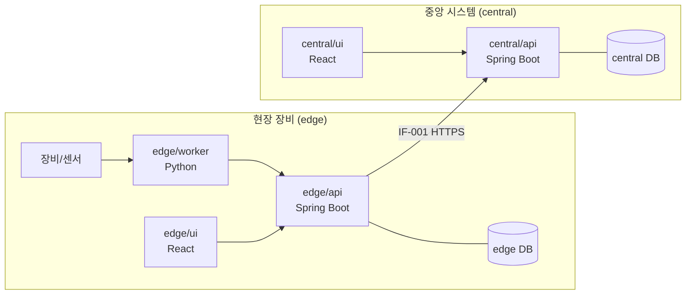

# 아키텍처 설계서

구조가 바뀌는 스토리와 단계 말에 갱신한다. 모듈 내부 레이어 규칙은 `docs/conventions/`에 있다.

## 시스템 구성

## 배포 구성

| 구성요소 | 배포 단위 | 실행 환경 | 비고 |
|---|---|---|---|
| edge/api + edge/ui | WAR 1개 | <OS, Tomcat 버전> | UI 빌드 결과 포함 |
| edge/worker | systemd 서비스 | <Python 버전> | |
| central/api + central/ui | <WAR/컨테이너> | <서버 사양> | |
| DB | PostgreSQL <버전> | | edge·central 별도 |

## 기술 스택과 선정 이유

| 영역 | 선택 | 이유 |
|---|---|---|
| <백엔드> | <Spring Boot 3.x / Java 17> | <조직 표준, 전자정부 프레임워크 호환 등> |

## 주요 설계 결정

| 날짜 | 결정 | 이유 | 스토리 |
|---|---|---|---|
| <YYYY-MM-DD> | <edge는 central 장애 시에도 동작하도록 로컬 큐 사용> | <현장 네트워크 불안정> | |
