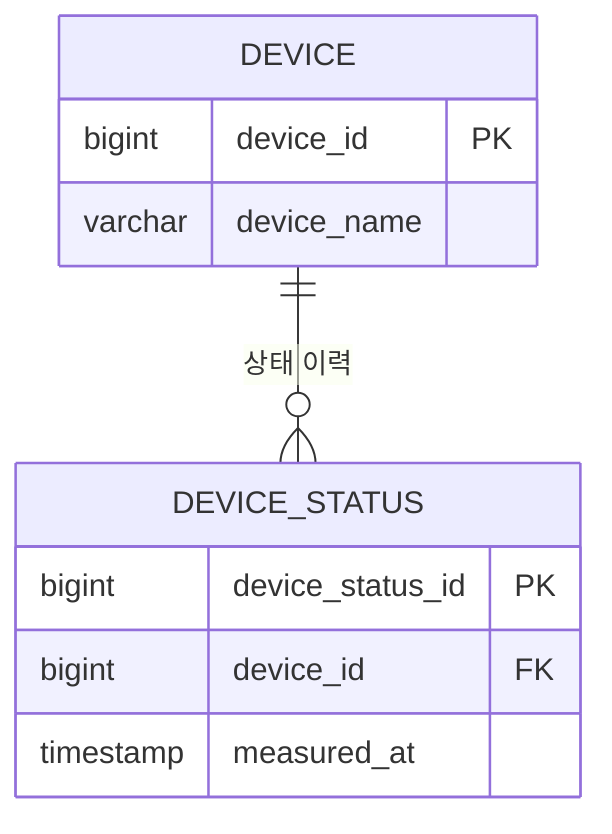
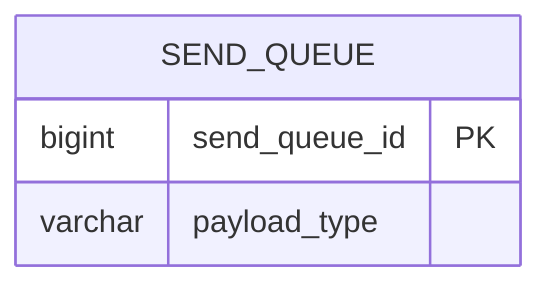

# 엔티티 관계 모형 (ERD)

**기준은 DDL이다** (`edge/docs/database/`, `central/docs/database/`). DDL을 바꾸는 스토리는 이 문서를 같은 스토리에서 갱신한다.
컬럼 단위 상세는 DDL의 `comment on`에서 자동 생성되는 `generated/table-spec.md`(테이블 정의서)를 본다.
ERD에는 관계 파악에 필요한 키 컬럼과 핵심 컬럼만 둔다.

## central DB

## edge DB

## 엔티티 설명

| 엔티티 | DB | 설명 | 관련 UC |
|---|---|---|---|
| DEVICE | central | <현장 장비> | UC-001 |
