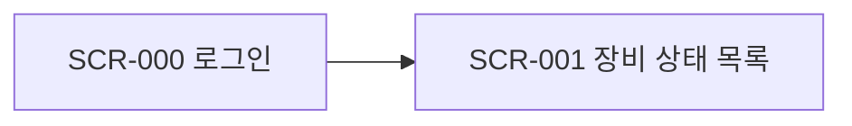

# 화면 목록

정의가 `—`인 화면은 아직 상세화하지 않은 것이다. 해당 스토리의 `story-design`에서 [템플릿](../_templates/screen.md)으로 `SCR-###-slug.md`를 만든다.

| ID | 화면명 | URL | 모듈 | 접근 액터 | 관련 UC | 정의 |
|---|---|---|---|---|---|---|
| SCR-001 | <장비 상태 목록> | `/devices` | central/ui | ACT-01 | UC-001 | — |

## 화면 흐름도

