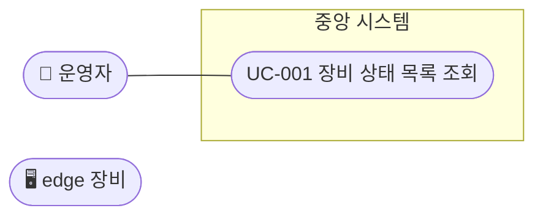

# 유스케이스 목록

명세가 `—`인 항목은 아직 상세화하지 않은 것이다. 해당 스토리의 `story-design`에서 [템플릿](../_templates/use-case.md)으로 `UC-###-slug.md`를 만든다.

| ID | 유스케이스 | 주 액터 | 관련 REQ | 관련 SCR | 명세 |
|---|---|---|---|---|---|
| UC-001 | <장비 상태 목록 조회> | ACT-01 | REQ-F-001 | SCR-001 | — |

## 개요도

Mermaid에는 UML 유스케이스 도형이 없어 `flowchart`로 그린다. 액터는 둥근 사각형, 유스케이스는 타원(`([ ])`), 시스템 경계는 `subgraph`.
