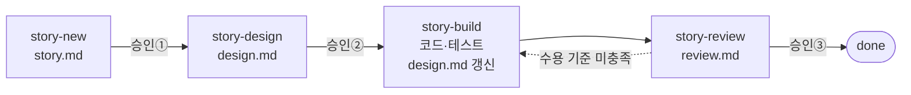

# 스토리 기록

기능 추가·변경은 스토리 단위로 진행하고, 각 단계의 중간 산출물을 이 폴더에 남긴다.
제품 전체 문서는 [../product/](../product/README.md)에 있고, 스토리가 끝날 때 그쪽도 갱신된다.
역할·승인·예시·공공 용역 단계와의 관계는 [개발 프로세스 가이드](../guides/development-process.md)를 본다.

## 흐름



| 상태 (`story.md` frontmatter) | 뜻 | 다음 단계 |
|---|---|---|
| `draft` | 스토리·수용 기준 작성 중 | 사용자 승인 → `ready` |
| `ready` | 수용 기준 합의됨 | `story-design` |
| `designed` | 설계·작업 목록 합의됨 | `story-build` |
| `in-progress` | 구현 중 | 작업 목록을 모두 끝내면 `review` |
| `review` | 수용 기준 검증 중 | 사용자 수락 → `done` |
| `done` | 완료 | |

`done`은 사용자가 리뷰 결과를 수락했을 때만 쓴다.

## 폴더와 브랜치

```text
docs/stories/S-007-device-status-list/
├── story.md     스토리, 수용 기준, 연결된 REQ·UC·SCR
├── design.md    설계, 영향 범위, 작업 목록(체크), 검증 로그
└── review.md    수용 기준별 증거, 문서-코드 일치 확인, 남은 일
```

- 번호는 이 폴더의 가장 큰 번호 + 1. 재사용하지 않는다.
- 브랜치는 `<type>/S-###-<slug>` (예: `feat/S-007-device-status-list`). 훅이 브랜치 이름으로 현재 스토리를 찾는다.
- 커밋 본문에 `Story: S-007`을 적는다.

## 스토리 없이 해도 되는 것

질문·조사, 오타·주석·문서만 고치는 변경, 설정값 조정, 긴급 장애 대응(사후에 스토리로 기록).

## R&D 과제의 연구노트

`design.md`의 검증 로그(날짜, 한 일, 결과)는 연구노트의 기초 자료로 쓸 수 있다.
다만 기관의 연구노트 규정(서명, 위·변조 방지, 전자연구노트 시스템)을 git만으로 충족하는지는 과제 관리 기관에 확인한다.
